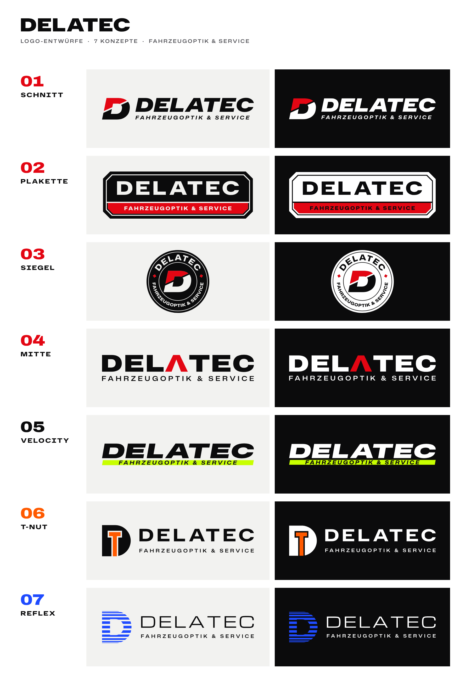

# DelaTec – sieben Logo-Entwürfe

Fahrzeugoptik & Service, Kisdorf. Vier Entwürfe führen die Richtung des ersten
Entwurfs (`../logo/`, Schwarz/Rot, geschnittenes D) weiter – schwerer, schärfer.
Drei stehen in **Schwarz plus einer knalligen Farbe**, streng und ohne Spielerei.



| Nr | Name | Farben | Idee |
|---|---|---|---|
| 01 | **Schnitt** | Schwarz · Rot | Kursives, schweres D mit messerscharfem Schnitt, oben das frisch lackierte Rot. Die direkte Weiterentwicklung des ersten Entwurfs. |
| 02 | **Plakette** | Schwarz · Rot | Wie die Plakette auf einem handgebauten Motor: ein Schild, das für die Arbeit bürgt. Gefaste Ecken, Rahmenlinie, rotes Band. |
| 03 | **Siegel** | Schwarz · Rot | Rundes Gütesiegel: oben der Name, unten das Versprechen, in der Mitte das geschnittene D. Passt exakt ins runde Profilbild. |
| 04 | **Mitte** | Schwarz · Rot | Das A steht genau in der Mitte von DELATEC – als rotes A ohne Querstrich: ein Pfeil nach oben, wie die Delle, die von innen herausgedrückt wird. |
| 05 | **Velocity** | Schwarz · Acid-Grün | Extrem breit, extrem schnell – wie das Dekor eines Rennwagens. Der Balken trägt das Leistungsversprechen. |
| 06 | **T-Nut** | Schwarz · Signal-Orange | Massives D mit eingefrästem T: DelaTec als Monogramm. Die T-Nut ist das Präzisionsprofil aus dem Maschinenbau. |
| 07 | **Reflex** | Schwarz · Electric-Blau | Dellen erkennt man an den Linien der Reflektorlampe. Hier spiegeln sie sich auf einem gewölbten D – wie auf poliertem Lack. |

Jeder Ordner hat eine `delatec-NN-praesentation.png`, die das Logo positiv, negativ, als
Bildzeichen und als Profilbild zeigt – gut zum Weiterschicken.

## Farben

| Farbe | HEX | RGB |
|---|---|---|
| Schwarz | `#0B0B0C` | 11 11 12 |
| Rot (01–04) | `#E30613` | 227 6 19 |
| Acid-Grün (05) | `#C8FF00` | 200 255 0 |
| Signal-Orange (06) | `#FF5A00` | 255 90 0 |
| Electric-Blau (07) | `#1F4BFF` | 31 75 255 |

Für Druck und Folie legt die Druckerei bzw. der Folierer CMYK-, Pantone- oder
Folienfarben anhand eines echten Farbfächers fest – Neonfarben wie das Acid-Grün gibt
es als Leuchtfolie, im normalen Vierfarbdruck wirken sie matter.

## Dateien je Logo

| Datei | Wofür |
|---|---|
| `delatec-NN-name.svg` / `.png` | Hauptlogo für hellen Grund |
| `delatec-NN-name-negativ.svg` / `.png` | für dunklen Grund (weiße Flächen, transparenter Hintergrund) |
| `delatec-NN-name-ohne-claim.svg` / `.png` (+ `-negativ`) | ohne Claim-Zeile, für kleine Formate (01, 04–07; Plakette und Siegel tragen den Claim im Schild) |
| `delatec-NN-zeichen.svg` / `.png` (+ `-negativ`) | Bildzeichen: Favicon, App-Icon, Stempel, Stick (beim Siegel ist das Siegel selbst das Zeichen) |
| `delatec-NN-instagram.svg` / `.png` | Profilbild 1080 × 1080, Inhalt sitzt sicher im Kreisausschnitt |
| `delatec-NN-praesentation.png` | Präsentationskarte |

Die SVGs bestehen nur aus Flächen – keine Schrift, keine Masken, keine Überlappungen.
Damit sind sie direkt plotbar (Fahrzeugbeschriftung, Werkstattschild, Folie) und lassen
sich in jedem Programm verlustfrei skalieren. PNGs haben einen transparenten Hintergrund.

**Hinweise zur Anwendung**
- Die Claim-Zeile („FAHRZEUGOPTIK & SERVICE“) ist nur rund 2 % so hoch wie das
  Logo breit ist. Unter etwa 80 mm Logobreite (Visitenkarte, Stempel, Kennzeichenhalter)
  deshalb die Version **ohne Claim** oder das Bildzeichen nehmen.
- Acid-Grün (05) hat auf Weiß wenig Kontrast. Es wirkt am stärksten auf Schwarz; auf
  hellem Grund trägt die schwarze Schrift im Balken die Lesbarkeit.
- Blau (07) auf Schwarz ist lesbar, leuchtet auf Weiß aber mehr.
- Der Claim steht an genau einer Stelle: `CLAIM` in `werkzeug/konzepte.py`. Alle
  Logos halten ihre Schrifthöhe und gleichen die Länge über die Sperrung aus – ein
  anderer Claim (oder „UND“ statt „&“) ist also eine Zeile plus `bauen.py`.

## Hausschriften

Alle Schriften stehen unter der SIL Open Font License – frei nutzbar, auch für
Visitenkarten, Website und Werbung. Lizenztexte in `werkzeug/schriften/`.

- **Hubot Sans** (Expanded, Black/ExtraBold, auch kursiv) – 01, 02, 06
- **Mona Sans** (Expanded) – Claims, Siegel
- **Archivo** (Expanded Black) – 04
- **Anybody** (Extra Expanded Black Italic) – 05
- **Michroma** – 07

## Neu erzeugen

Alles entsteht aus Code, jede Änderung ist reproduzierbar:

```bash
cd werkzeug
python3 -m venv .venv && .venv/bin/pip install -r requirements.txt
.venv/bin/python bauen.py        # braucht Node + Playwright/Chromium für die PNGs
```

- `werkzeug/typo.py` – setzt Schrift mit HarfBuzz (inkl. Unterschneidung) und macht
  daraus saubere Pfade (Skia PathOps).
- `werkzeug/konzepte.py` – die sieben Logos, Bildzeichen, Farben, Texte.
- `werkzeug/bauen.py` – exportiert alle Dateien und die Übersicht.
